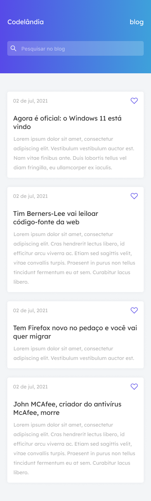

## Desafio realizado juntamente com a comunidade Codelândia

O desafio foi feito com HTML5 e CSS3.

#### Aprendizado aquirido:
- Uso de fontes
- Uso de ícones svg
- Váriaveis no css
- Media query

#### Preview da página - Versão Mobile e Desktop
